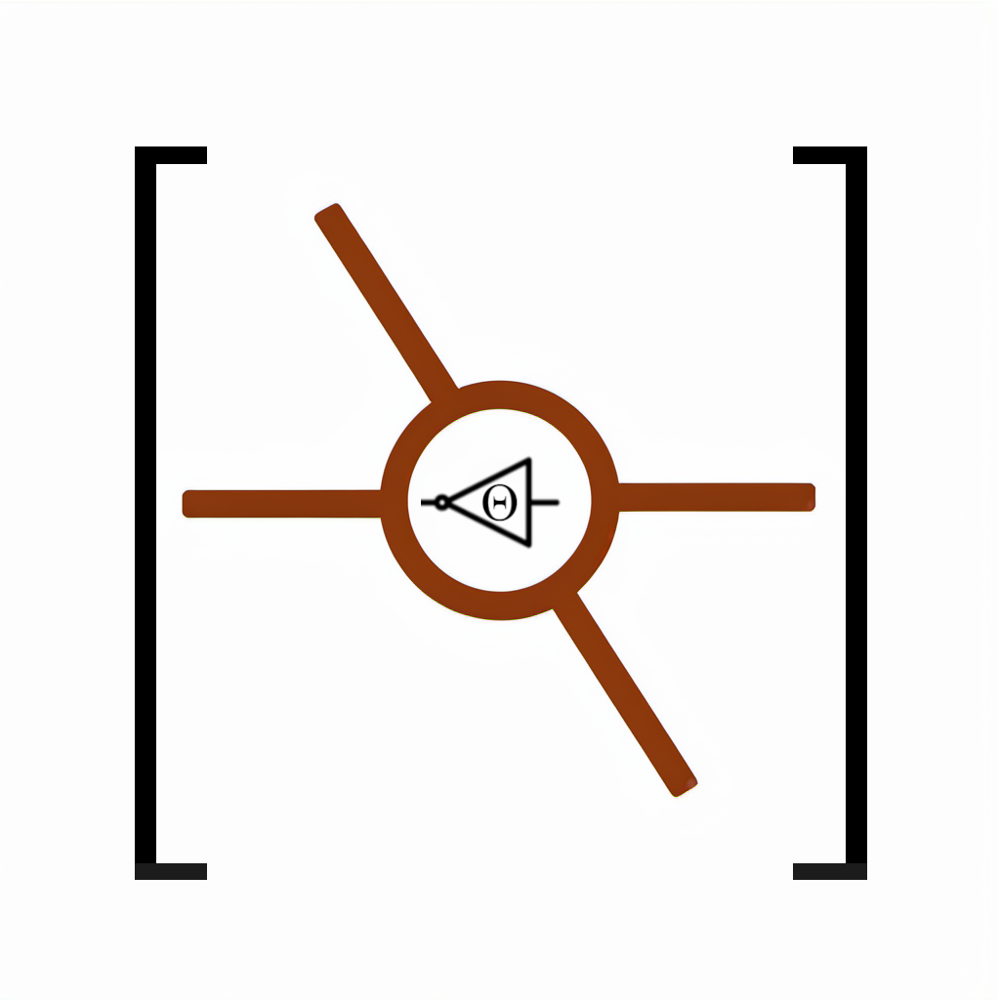

  

 <h3 align="center"><a href="https://join-lemmy.org">Algori</a></h3>
  

    Rust Algorithms
     
     
    <a href="https://docs.rs/algori">Docs</a>
    ·
    <a href="https://matrix.to/#/#algori:mozilla.org">Matrix</a>
  

## Algorithms
### Sorting 排序
- [Insertionsort 插入排序](./doc/sorting/README.md)
### Structures 数据结构
- [Heap 堆排序](./doc/structure/README.md)
